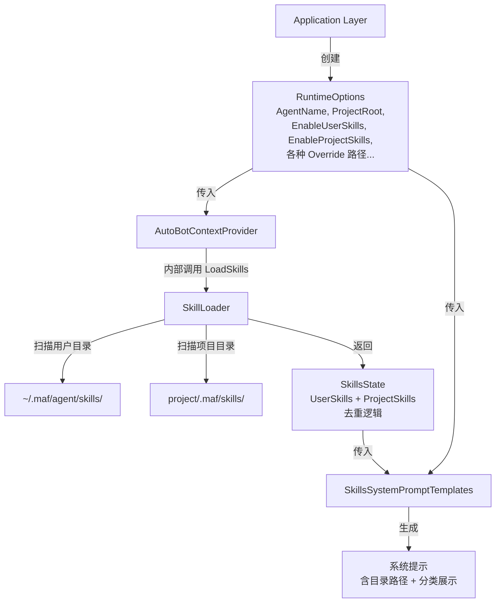
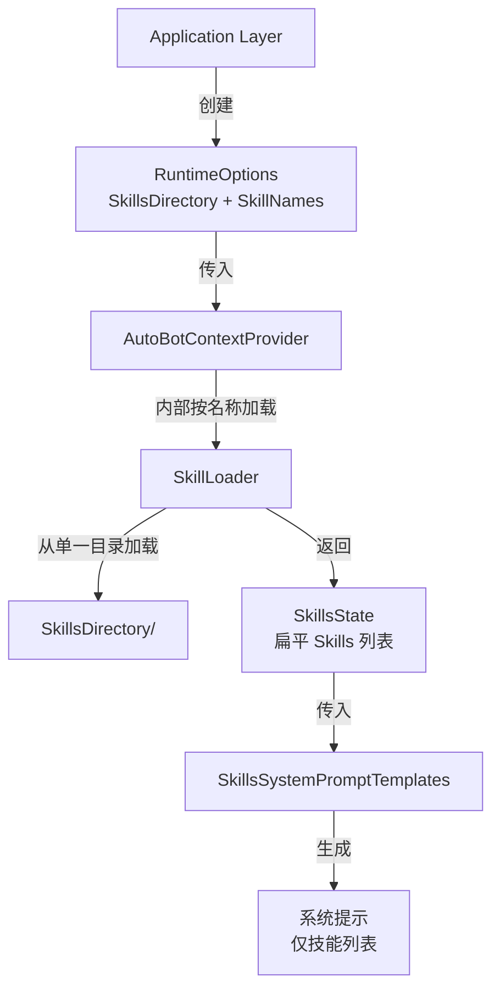

# 设计文档：移除技能目录配置

## 概述

本设计将 AutoBot 运行时从"多目录自动扫描发现技能"的架构改为"从单一目录按名称加载指定技能"的架构。核心变更包括：

1. 从 `RuntimeOptions` 中移除复杂的多目录技能配置，替换为 `SkillsDirectory` + `SkillNames`
2. 修改 `AutoBotContextProvider` 按名称从指定目录加载技能
3. 将 `SkillsState` 简化为扁平技能容器
4. 简化系统提示生成，移除目录路径展示和 User/Project 分类
5. 保留 `SkillLoader` 作为内部加载工具

## 架构

### 变更前架构



### 变更后架构



### 设计决策

1. **单一目录 + 名称列表**：`RuntimeOptions` 新增 `SkillsDirectory`（技能根目录）和 `SkillNames`（要加载的技能名称列表）。运行时从 `SkillsDirectory/{name}/` 子目录中按名称加载技能。这比传入完整 `SkillMetadata` 列表更简洁，开发者只需指定目录和名称。

2. **移除 SkillSource 枚举**：完全删除 `SkillSource` 枚举及其在 `SkillMetadata`、`SkillLoader`、`SkillParser` 中的所有引用。不再区分技能来源。

3. **SkillsSystemPromptTemplates 不再依赖 RuntimeOptions**：`GenerateSystemPrompt` 方法签名简化为仅接受 `SkillsState`，移除对 `RuntimeOptions` 的依赖。

4. **SkillLoader 新增按名称加载方法**：在 `SkillLoader` 中新增 `LoadSkillByName(string skillsDirectory, string skillName)` 方法，从指定目录中加载单个技能。

## 组件与接口

### RuntimeOptions（修改后）

移除以下属性：
- `AgentName`
- `ProjectRoot`
- `EnableUserSkills` / `EnableProjectSkills`
- `UserSkillsDirectoryOverride` / `ProjectSkillsDirectoryOverride`
- `RefreshIntervalSeconds`

新增以下属性：
- `SkillsDirectory` — 技能根目录路径
- `SkillNames` — 要加载的技能名称列表

```csharp
public sealed class RuntimeOptions
{
    // 基础路径
    public string WorkingDirectory { get; set; } = Directory.GetCurrentDirectory();

    // 技能配置（简化后）
    public string? SkillsDirectory { get; set; }
    public IList<string> SkillNames { get; set; } = new List<string>();

    // 工具启停
    public bool EnableReadFile { get; set; } = true;
    public bool EnableWriteFile { get; set; } = true;
    public bool EnableListDirectory { get; set; } = true;
    public bool EnableSearchFiles { get; set; } = true;
    public bool EnableRunCommand { get; set; } = false;
    public bool EnableReadSkill { get; set; } = true;

    // 资源限制
    public int MaxFileSizeBytes { get; set; } = 10 * 1024 * 1024;
    public int CommandTimeoutSeconds { get; set; } = 60;
    public int MaxOutputSizeBytes { get; set; } = 100 * 1024;

    // 执行策略
    public ExecutionPolicyOptions ExecutionPolicy { get; } = new();
}
```

### AutoBotContextProvider（修改后）

`LoadSkills()` 方法简化为从 `SkillsDirectory` 中按 `SkillNames` 逐个加载：

```csharp
public sealed class AutoBotContextProvider : AIContextProvider
{
    private readonly RuntimeOptions _options;
    private readonly SkillLoader _skillLoader;
    private SkillsState _state;

    public AutoBotContextProvider(RuntimeOptions options)
    {
        _options = options;
        _skillLoader = new SkillLoader();
        _state = LoadSkills();
    }

    // 反序列化构造函数保持不变
    public AutoBotContextProvider(
        JsonElement serializedState,
        JsonSerializerOptions? jsonSerializerOptions) { ... }

    private SkillsState LoadSkills()
    {
        var skills = new List<SkillMetadata>();

        if (!string.IsNullOrEmpty(_options.SkillsDirectory) && _options.SkillNames.Count > 0)
        {
            foreach (var name in _options.SkillNames)
            {
                var skill = _skillLoader.LoadSkillByName(_options.SkillsDirectory, name);
                if (skill is not null)
                {
                    skills.Add(skill);
                }
            }
        }

        return new SkillsState { Skills = skills };
    }

    protected override ValueTask<AIContext> InvokingCoreAsync(...)
    {
        // GenerateSystemPrompt 不再传入 RuntimeOptions
        var systemPrompt = SkillsSystemPromptTemplates.GenerateSystemPrompt(_state);
        var factory = new ToolFactory(_options, _state, _skillLoader);
        // ...
    }
}
```

### SkillsState（简化后）

```csharp
public sealed class SkillsState
{
    public IReadOnlyList<SkillMetadata> Skills { get; init; } = [];

    public IReadOnlyList<SkillMetadata> AllSkills => Skills;

    public SkillMetadata? GetSkill(string name)
    {
        return Skills.FirstOrDefault(
            s => s.Name.Equals(name, StringComparison.OrdinalIgnoreCase));
    }
}
```

### SkillsSystemPromptTemplates（简化后）

```csharp
public static class SkillsSystemPromptTemplates
{
    // 模板中移除 {skills_locations} 占位符
    public const string SystemPromptTemplate = """
        ## Skills System
        ...
        **Available Skills:**
        {skills_list}
        ...
        """;

    // 签名简化：移除 RuntimeOptions 参数
    public static string GenerateSystemPrompt(SkillsState state)
    {
        var skillsList = GenerateSkillsList(state);
        return SystemPromptTemplate.Replace("{skills_list}", skillsList);
    }

    private static string GenerateSkillsList(SkillsState state)
    {
        if (state.Skills.Count == 0)
            return "*No skills available.*";

        var lines = state.Skills.Select(s => s.ToDisplayString());
        return string.Join("\n", lines);
    }

    // 移除 GenerateSkillsLocationsDisplay 方法
}
```

### SkillLoader（修改方法签名 + 新增方法）

移除所有方法中的 `SkillSource` 参数。新增按名称加载单个技能的方法：

```csharp
public sealed class SkillLoader
{
    // 现有方法保留，但移除 SkillSource 参数
    public IEnumerable<SkillMetadata> LoadSkillsFromDirectory(string skillsDirectory) { ... }

    // 新增：按名称从目录加载单个技能
    public SkillMetadata? LoadSkillByName(string skillsDirectory, string skillName)
    {
        var skillDir = Path.Combine(skillsDirectory, skillName);
        return TryLoadSkill(skillDir);
    }

    // TryLoadSkill 移除 SkillSource 参数
}
```

### ReadSkillTool（小幅修改）

`ReadSkillTool` 内部调用 `SkillsState.GetSkill()` 和 `SkillLoader.ReadSkillContent()`。核心查找逻辑不变，但需要从 JSON 输出中移除 `source` 字段（因为 `SkillSource` 已删除）。

### SkillSource（删除）

完全删除 `SkillSource.cs` 文件。所有引用 `SkillSource` 的代码（`SkillMetadata`、`SkillLoader`、`SkillParser`、`ReadSkillTool` 的 JSON 输出中的 `source` 字段）均需移除。

### SkillParser（修改方法签名）

`Parse` 和 `ParseContent` 方法移除 `SkillSource source` 参数：

```csharp
public SkillMetadata Parse(string skillFilePath) { ... }
public SkillMetadata ParseContent(string content, string skillDirectory, string directoryName) { ... }
```

## 数据模型

### SkillMetadata（修改后）

移除 `Source` 参数：

```csharp
public sealed record SkillMetadata(
    string Name,
    string Description,
    string Path,
    string? License = null,
    string? Compatibility = null,
    IReadOnlyDictionary<string, string>? Metadata = null,
    IReadOnlyList<AllowedTool>? AllowedTools = null);
```

### SkillsState（新数据模型）

```csharp
public sealed class SkillsState
{
    public IReadOnlyList<SkillMetadata> Skills { get; init; } = [];
}
```

### RestoredContext（反序列化容器）

```csharp
private sealed class RestoredContext
{
    public RuntimeOptions Options { get; set; } = new();
    public SkillsState State { get; set; } = new();
}
```

由于 `SkillsState` 的属性从 `UserSkills`/`ProjectSkills` 变为 `Skills`，旧的序列化数据中不会有 `Skills` 字段。反序列化时 `Skills` 将默认为空列表，不会抛异常。


## 正确性属性

*正确性属性是一种在系统所有有效执行中都应成立的特征或行为——本质上是关于系统应该做什么的形式化陈述。属性是人类可读规范与机器可验证正确性保证之间的桥梁。*

### Property 1: 仅加载指定名称的技能

*For any* skills directory containing N skill subdirectories and any subset S of skill names from those subdirectories, when AutoBotContextProvider loads skills with SkillNames = S, the resulting SkillsState.Skills should contain exactly the skills whose names are in S (and that exist as valid skill subdirectories).

**Validates: Requirements 2.1**

### Property 2: AllSkills 返回原始列表（无去重）

*For any* SkillsState with a flat Skills list (including lists with duplicate names), AllSkills should return the exact same collection without any filtering or deduplication.

**Validates: Requirements 3.2**

### Property 3: 技能名称大小写不敏感查找

*For any* SkillsState containing a skill with name N, calling GetSkill with any case variation of N (uppercase, lowercase, mixed) should return a SkillMetadata whose Name case-insensitively equals N.

**Validates: Requirements 3.3**

### Property 4: 系统提示包含所有技能信息且不含目录路径

*For any* SkillsState with a non-empty Skills list, the generated system prompt should contain every skill's Name and Description, and should not contain any User/Project skill directory path patterns (e.g., `~/.maf/`, `{ProjectRoot}/.maf/skills/`).

**Validates: Requirements 4.1, 4.2**

### Property 5: 状态序列化往返一致性

*For any* valid RuntimeOptions and SkillsState, serializing the AutoBotContextProvider state and then deserializing it should produce an equivalent RuntimeOptions (with same SkillsDirectory, SkillNames, tool flags, resource limits) and SkillsState (with same Skills list content).

**Validates: Requirements 7.1, 7.2**

## 错误处理

| 场景 | 处理方式 |
|------|----------|
| `SkillsDirectory` 为 null 或空 | 不加载任何技能，SkillsState.Skills 为空列表 |
| `SkillNames` 为空列表 | 不加载任何技能，SkillsState.Skills 为空列表 |
| `SkillNames` 中的名称对应的子目录不存在 | 跳过该名称，继续加载其余技能 |
| 技能子目录存在但 SKILL.md 解析失败 | 跳过该技能，记录警告日志 |
| GetSkill 查找不存在的技能 | 返回 null |
| ReadSkillTool 查找不存在的技能 | 返回 JSON 错误响应 `{ success: false, error: "..." }` |
| 反序列化旧格式数据（含 UserSkills/ProjectSkills） | Skills 默认为空列表，不抛异常 |
| 空技能列表时生成系统提示 | 显示 "*No skills available.*" |

## 测试策略

### 测试框架

- 单元测试：xUnit
- 属性测试：FsCheck + xUnit（FsCheck.Xunit）
- 项目语言：C#

### 属性测试

每个正确性属性对应一个属性测试，使用 FsCheck 生成随机输入，最少运行 100 次迭代。

每个测试需标注注释引用设计文档中的属性编号：
```
// Feature: remove-skill-catalog-config, Property N: <属性标题>
```

需要自定义 FsCheck Arbitrary 生成器来生成有效的 `SkillMetadata` 实例（合法名称、描述、路径等）。

Property 1（仅加载指定名称的技能）需要文件系统交互，可通过创建临时目录和技能文件来测试，或通过 mock SkillLoader 来隔离测试。

### 单元测试

单元测试覆盖以下场景：
- RuntimeOptions 不包含已移除的属性（反射检查）
- RuntimeOptions 包含新增的 SkillsDirectory 和 SkillNames 属性
- AutoBotContextProvider 空配置边界情况（null 目录、空名称列表）
- SkillNames 中包含无效名称时的跳过行为
- ReadSkillTool 对存在和不存在技能的响应
- SkillsSystemPromptTemplates 空技能列表时的输出

### 测试平衡

- 属性测试：验证跨所有输入的通用属性（5 个属性测试）
- 单元测试：验证特定示例、边界情况和错误条件
- 两者互补，属性测试覆盖广度，单元测试覆盖深度
