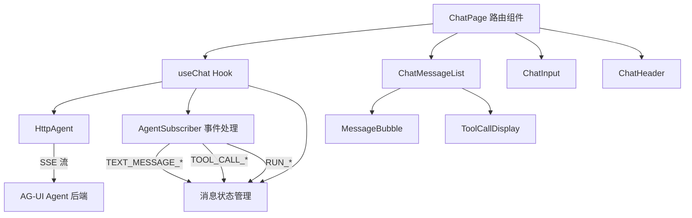
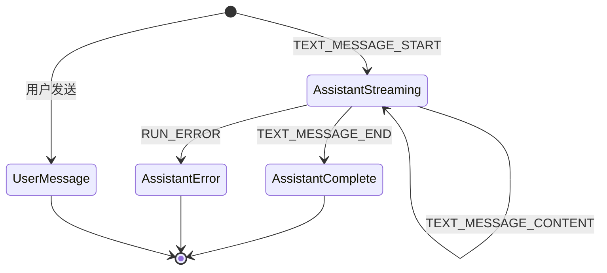

# 设计文档：AG-UI 对话客户端

## 概述

本设计描述一个基于 React 19 + TypeScript 的 AI 对话客户端，使用 `@ag-ui/client` 的 `HttpAgent` 类与 AG-UI 兼容的 Agent 后端通信。核心架构围绕一个自定义 React Hook（`useChat`）构建，该 Hook 封装了 Agent 通信逻辑、消息状态管理和流式事件处理。UI 层由独立的展示组件组成，通过 Tailwind CSS 实现样式。

## 架构



### 设计决策

1. **自定义 Hook 封装 Agent 逻辑**：将 `HttpAgent` 的创建、事件订阅、消息状态管理全部封装在 `useChat` Hook 中，使 UI 组件保持纯展示职责。
2. **使用 `useRef` 持有 Agent 实例**：`HttpAgent` 实例在组件生命周期内保持稳定，避免重复创建。通过 `useRef` 而非 `useState` 持有，防止不必要的重渲染。
3. **基于 `AgentSubscriber` 的事件驱动更新**：利用 `runAgent` 的 subscriber 参数处理流式事件，在回调中更新 React 状态。
4. **Markdown 渲染**：使用 `react-markdown` 库渲染 assistant 消息中的 Markdown 内容，配合 `remark-gfm` 支持 GFM 扩展语法（表格、删除线等）。
5. **UI 组件库**：使用 shadcn/ui 组件库构建界面，基于 Radix UI 原语 + Tailwind CSS，提供一致的设计语言和可访问性支持。

## 组件与接口

### 文件结构

```
src/
├── hooks/
│   └── useChat.ts              # 核心 Hook：Agent 通信 + 状态管理
├── components/
│   ├── ui/                     # shadcn/ui 基础组件
│   │   ├── button.tsx
│   │   ├── textarea.tsx
│   │   ├── scroll-area.tsx
│   │   ├── card.tsx
│   │   └── collapsible.tsx
│   ├── ChatMessageList.tsx     # 消息列表容器（自动滚动）
│   ├── MessageBubble.tsx       # 单条消息气泡
│   ├── ChatInput.tsx           # 输入框 + 发送/中止按钮
│   ├── ToolCallDisplay.tsx     # 工具调用展示组件
│   └── MarkdownRenderer.tsx    # react-markdown 封装组件
├── lib/
│   └── utils.ts                # shadcn/ui cn() 工具函数
└── routes/
    └── index.tsx               # 主页路由（ChatPage）
```

### 依赖说明

| 包名 | 用途 |
|------|------|
| `react-markdown` | Markdown 渲染 |
| `remark-gfm` | GFM 扩展语法支持 |
| `tailwind-merge` | Tailwind 类名合并（shadcn/ui 依赖） |
| `clsx` | 条件类名拼接（shadcn/ui 依赖） |
| `class-variance-authority` | 组件变体样式（shadcn/ui 依赖） |
| `@radix-ui/react-collapsible` | 可折叠组件原语（工具调用展示） |
| `@radix-ui/react-scroll-area` | 滚动区域组件原语 |

### useChat Hook

```typescript
interface UseChatReturn {
  messages: ChatMessage[];
  isRunning: boolean;
  error: string | null;
  sendMessage: (content: string) => void;
  abortRun: () => void;
  clearChat: () => void;
}

function useChat(agentUrl: string): UseChatReturn;
```

**职责**：
- 创建并持有 `HttpAgent` 实例（通过 `useRef`）
- 管理 `messages`、`isRunning`、`error` 状态
- `sendMessage`：验证输入 → 添加用户消息 → 调用 `agent.runAgent()` 并传入 subscriber
- `abortRun`：调用 `agent.abortRun()`
- `clearChat`：清空消息列表，重置 Agent 状态

### AgentSubscriber 事件处理

在 `sendMessage` 中，通过 `runAgent` 的第二个参数传入 `AgentSubscriber`：

```typescript
const subscriber: AgentSubscriber = {
  onTextMessageStartEvent: ({ event }) => {
    // 创建新的 assistant 消息占位
  },
  onTextMessageContentEvent: ({ event }) => {
    // 追加文本内容到当前 assistant 消息
  },
  onTextMessageEndEvent: () => {
    // 标记消息完成
  },
  onToolCallStartEvent: ({ event }) => {
    // 添加工具调用记录
  },
  onToolCallArgsEvent: ({ event }) => {
    // 更新工具调用参数
  },
  onToolCallEndEvent: ({ event }) => {
    // 标记工具调用完成
  },
  onRunErrorEvent: ({ event }) => {
    // 设置错误状态
  },
};
```

### ChatInput 组件

```typescript
interface ChatInputProps {
  onSend: (content: string) => void;
  onAbort: () => void;
  isRunning: boolean;
  disabled: boolean;
}
```

- 使用 shadcn/ui 的 `Textarea` 和 `Button` 组件
- 运行中时显示中止按钮（使用 lucide-react 的 `Square` 图标），空闲时显示发送按钮（`SendHorizontal` 图标）
- Enter 发送（Shift+Enter 换行）
- 空白内容时禁用发送

### ChatMessageList 组件

```typescript
interface ChatMessageListProps {
  messages: ChatMessage[];
}
```

- 使用 shadcn/ui 的 `ScrollArea` 组件包裹消息列表
- 渲染消息列表，每条消息使用 `MessageBubble`
- 使用 `useRef` + `useEffect` 实现自动滚动到底部

### MessageBubble 组件

```typescript
interface MessageBubbleProps {
  message: ChatMessage;
}
```

- 根据 `role` 决定对齐方向和样式
- user 消息靠右，使用主题色背景
- assistant 消息靠左，使用 shadcn/ui `Card` 组件包裹
- assistant 消息内容通过 `MarkdownRenderer` 渲染
- 使用 lucide-react 图标区分角色（`User` / `Bot`）

### ToolCallDisplay 组件

```typescript
interface ToolCallDisplayProps {
  toolCall: ChatToolCall;
}
```

- 使用 shadcn/ui 的 `Collapsible` 组件实现可折叠/展开
- 展示工具名称和参数
- 默认折叠，点击展开参数详情

### MarkdownRenderer 组件

```typescript
interface MarkdownRendererProps {
  content: string;
}
```

- 封装 `react-markdown` 组件，配合 `remark-gfm` 插件
- 自定义代码块渲染：使用 `<pre><code>` 并添加语言类名和 Tailwind 样式
- 自定义链接渲染：添加 `target="_blank"` 和 `rel="noopener noreferrer"`

## 数据模型

### ChatMessage

```typescript
interface ChatToolCall {
  id: string;
  name: string;
  args: string;
  isComplete: boolean;
}

interface ChatMessage {
  id: string;
  role: 'user' | 'assistant';
  content: string;
  isStreaming: boolean;
  toolCalls: ChatToolCall[];
  isError: boolean;
}
```

### 消息状态流转




## 正确性属性

*属性（Property）是一种在系统所有有效执行中都应成立的特征或行为——本质上是关于系统应该做什么的形式化陈述。属性是人类可读规范与机器可验证正确性保证之间的桥梁。*

### Property 1：发送有效消息增长消息列表

*For any* 非空且非纯空白的文本输入，发送该消息后 Message_List 的长度应增加 1，且新增消息的 role 为 "user"，content 等于输入文本。

**Validates: Requirements 1.1**

### Property 2：纯空白输入被拒绝

*For any* 仅由空白字符（空格、制表符、换行符）组成的字符串，尝试发送该消息后 Message_List 应保持不变。

**Validates: Requirements 1.2**

### Property 3：发送后输入框被清空

*For any* 有效的消息发送操作，发送完成后 Input_Field 的值应为空字符串。

**Validates: Requirements 1.3**

### Property 4：流式文本内容累积正确性

*For any* TEXT_MESSAGE_CONTENT 事件序列，最终 assistant 消息的 content 应等于所有事件 content 字段的按序拼接结果。

**Validates: Requirements 2.3**

### Property 5：运行中 UI 状态一致性

*For any* 处于 isRunning 为 true 的状态，Input_Field 应处于禁用状态，发送按钮应处于禁用状态，且中止按钮应可见。

**Validates: Requirements 2.5, 6.1**

### Property 6：运行终止后 UI 恢复

*For any* 运行终止事件（RUN_ERROR、RUN_FINISHED 或 abortRun 调用），终止后 Input_Field 和发送按钮应重新启用，isRunning 应为 false。

**Validates: Requirements 5.3, 6.3**

### Property 7：工具调用参数累积正确性

*For any* TOOL_CALL_ARGS 事件序列（属于同一个 tool call），最终工具调用的 args 应等于所有事件 args 字段的按序拼接结果。

**Validates: Requirements 4.2**

### Property 8：Markdown 渲染输出包含源内容

*For any* 包含纯文本段落的 Markdown 字符串，MarkdownRenderer 组件的渲染输出应包含该文本内容（即 react-markdown 正确传递了内容）。

**Validates: Requirements 3.3**

## 错误处理

| 错误场景 | 处理方式 |
|---------|---------|
| 网络连接失败 | 捕获 fetch 异常，设置 error 状态，显示错误提示，重新启用输入 |
| RUN_ERROR 事件 | 通过 `onRunErrorEvent` 回调捕获，设置 error 状态并显示错误消息 |
| Agent 请求超时 | 依赖 HttpAgent 内部超时机制，通过 error 事件处理 |
| 用户中止请求 | 调用 `abortRun()`，清理运行状态，重新启用输入 |
| 空白消息发送 | 在 `sendMessage` 中前置验证，trim 后为空则直接返回 |

错误消息以特殊样式的 `ChatMessage`（`isError: true`）展示在对话流中，而非使用弹窗或 toast，保持对话上下文的连贯性。

## 测试策略

### 双重测试方法

本项目采用单元测试与属性测试相结合的方式：

- **单元测试**：验证具体示例、边界情况和错误条件
- **属性测试**：验证跨所有输入的通用属性

### 测试框架

- **测试运行器**：Vitest
- **属性测试库**：`fast-check`
- **React 测试**：`@testing-library/react` + `@testing-library/dom`

### 属性测试配置

- 每个属性测试最少运行 100 次迭代
- 每个属性测试必须通过注释引用设计文档中的属性编号
- 标签格式：**Feature: ag-ui-chat-client, Property {number}: {property_text}**
- 每个正确性属性由一个独立的属性测试实现

### 单元测试重点

- AG-UI 事件处理流程（TEXT_MESSAGE_START → CONTENT → END）
- 工具调用事件处理（TOOL_CALL_START → ARGS → END）
- 错误事件处理和 UI 恢复
- 组件渲染和交互（发送按钮、中止按钮、新对话按钮）
- 初始状态和欢迎界面

### 属性测试重点

- 消息发送验证（Property 1, 2, 3）
- 流式内容累积（Property 4, 7）
- UI 状态一致性（Property 5, 6）
- Markdown 解析（Property 8）
